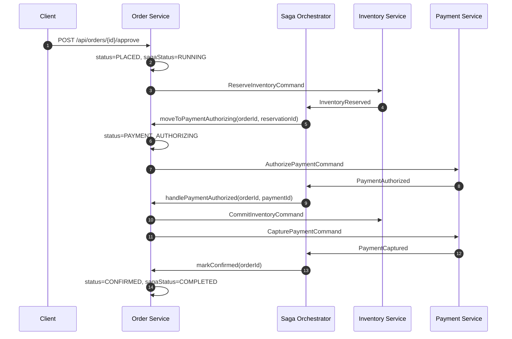

# 지능형 쇼핑 에이전트 (Intelligent Shopping Agent)

## A. 프로젝트 개요

지능형 쇼핑 에이전트 시스템은 사용자에게 통합적인 대화형 쇼핑 경험을 제공하는 마이크로서비스 아키텍처 기반의 시스템입니다. 사용자는 자연어로 대화하며 상품을 검색하고, 기존 구매자들의 리뷰를 바탕으로 의사결정을 내릴 수 있습니다. 사용자의 장바구니 관리, 최종 주문 처리, 상점의 정책 확인까지 모든 과정을 인공지능 에이전트가 지원합니다.

시스템은 LLM(대규모 언어 모델) 기반의 에이전트 서비스와 전통적인 이커머스 백엔드 서비스를 결합했습니다. 핵심 기능은 다음과 같습니다.
* **상품 검색**: PostgreSQL의 Full Text Search(FTS)를 적용한 강력한 키워드 및 자연어 기반 상품 검색
* **리뷰 RAG(Retrieval-Augmented Generation)**: 기존 리뷰 데이터를 실시간으로 벡터화하여, 사용자 질문에 가장 적합한 리뷰 내용을 기반으로 답변 생성
* **장바구니 및 주문 관리**: 분산 트랜잭션 환경에서 Saga 패턴을 활용한 안정적인 주문 처리
* **정책 RAG**: 환불이나 교환 같은 상점 정책을 검색하고 안내하는 하이브리드 검색 기반 RAG 체계
* **AI 에이전트 오케스트레이션**: LangGraph 기반의 여러 전문 하위 에이전트들이 협력하여 사용자 의도를 파악하고 적절한 백엔드 API를 호출

## B. 시스템 아키텍처

아래는 9개의 서비스와 인프라스트럭처가 상호 작용하는 전체 시스템 구조입니다.

```text
                               +--------------------------------------------------+
                               |                  User (Client)                   |
                               +------------------------+-------------------------+
                                                        | REST API
                               +------------------------v-------------------------+
                               |          Gateway Service (Port 80 / 8080)        |
                               +----+-------------------+--------------------+----+
                                    |                   |                    |
          +-------------------------+                   |                    +-------------------------+
          | REST API                                    | REST API                                     | REST API
+---------v---------+                         +---------v---------+                          +---------v---------+
|   Agent Service   | <---------------------> |    RAG Service    |                          |  Backend Services |
|   (Port 8000)     |                         |    (Port 8002)    |                          |                   |
|                   |                         |                   |                          |                   |
|  [Supervisor]     |                         |  [pgvector DB]    |                          |                   |
|   |-> Product     |                         |   - Reviews       |                          |                   |
|   |-> Review      |                         |   - Policies      |                          |                   |
|   |-> Cart        |                         +---------^---------+                          |                   |
|   |-> Customer    |                                   | Kafka                              |                   |
+-------------------+                                   | (review.events)                    |                   |
                                                        |                                    |                   |
                               +------------------------+-------------------------+          |                   |
                               |                   Apache Kafka                   |          |                   |
                               +------------------------^-------------------------+          |                   |
                                                        |                                    |                   |
          +---------------------------------------------+------------------------------------+---------+         |
          |                                                                                            |         |
+---------+---------+  +-------------------+  +-------------------+  +-------------------+  +----------+---------+
|  Review Service   |  |  Product Service  |  |   Order Service   |  | Inventory Service |  |   Payment Service  |
|   (Port 8082)     |  |    (Port 8081)    |  |    (Port 8083)    |  |    (Port 8084)    |  |    (Port 8085)     |
|                   |  |                   |  |                   |  |                   |  |                    |
|  - Outbox Pattern |  |  - FTS Search     |  |  - Saga Pattern   |  |  - Kafka Consumer |  |  - Kafka Consumer  |
+---------+---------+  +---------+---------+  +---------+---------+  +---------+---------+  +----------+---------+
          |                      |                      |                      |                       |
      [PostgreSQL]           [PostgreSQL]           [PostgreSQL]           [PostgreSQL]            [PostgreSQL]
```

## C. 기술 스택

### Agent 및 RAG (Python 환경)
* **프레임워크**: FastAPI
* **에이전트**: LangGraph, LangChain
* **LLM 및 임베딩**: OpenAI GPT-5-mini, text-embedding-3-small
* **데이터베이스**: PostgreSQL (pgvector 확장), Redis (세션/체크포인트)

### Backend 서비스 (Java 환경)
* **프레임워크**: Spring Boot 3.x, Spring Cloud Gateway
* **데이터 액세스**: Spring Data JPA, PostgreSQL 16
* **메시징**: Spring Kafka
* **캐시**: Redis

### 인프라스트럭처 및 관측성
* **컨테이너**: Docker Compose
* **메시지 브로커**: Apache Kafka (Confluent), Zookeeper
* **관측성**: OpenTelemetry Collector, Jaeger

### 테스트
* **Java**: JUnit 5, Mockito
* **Python**: pytest

## D. 서비스 상세

시스템을 구성하는 총 9개의 서비스를 역할별로 분리하여 설명합니다.

### 1. Gateway Service (Port 8080, 외부에 80으로 노출)
Spring Cloud Gateway를 기반으로 모든 클라이언트 요청의 단일 진입점 역할을 수행합니다.
* **라우팅 설정**: 모든 백엔드 서비스(`/api/products/**`, `/api/reviews/**`, `/api/orders/**`, `/api/carts/**`, `/api/inventory/**`, `/api/payments/**`) 및 Agent 서비스(`/api/chat`, `/health`, `/api/docs`, `/api/openapi.json`)로 트래픽을 분배합니다.
* **Rate Limiting**: Redis 바탕의 `RequestRateLimiter`를 적용해 과도한 요청을 방어합니다.
* **분산 추적**: 모든 요청에 `correlationId`를 주입하고 전달하여 마이크로서비스 간 흐름을 추적합니다.

### 2. Product Service (Port 8081)
상품 정보의 조회와 검색을 담당합니다. PostgreSQL의 `to_tsvector`와 `websearch_to_tsquery`를 이용한 Full Text Search를 구현했습니다.
* **API 목록**:
  * `GET /api/products`: 조건(category, brand, minPrice, maxPrice, search, page, size, sort)에 맞는 상품 검색
  * `GET /api/products/{id}`: 상품 상세 정보 조회. 호출 시 `product.viewed.v1` Kafka 이벤트를 발행합니다.
  * `GET /api/products/{id}/variants`: 상품의 옵션(색상, 사이즈 등) 목록 조회
  * `GET /api/products/categories`: 전체 카테고리 트리 조회
  * `POST /api/products`: 신규 상품 및 옵션 등록 (`@Valid` 검증, 상태 코드 201 반환)
* Redis 캐시를 통해 빈번한 조회의 성능을 개선했습니다.

### 3. Review Service (Port 8082)
사용자 리뷰를 관리하며, 트랜잭셔널 아웃박스(Outbox) 패턴을 적용해 메시지 발행의 신뢰성을 보장합니다.
* **아웃박스 패턴 적용**: 리뷰 생성 시 동일한 데이터베이스 트랜잭션 내에 `OutboxEvent`를 저장합니다. 별도의 스케줄러(OutboxPublisher)가 이를 주기적으로 폴링해 Kafka의 `review.events` 토픽으로 전송합니다.
* **OutboxEvent 엔티티**: aggregateType, aggregateId, eventType, payload(JSONB 형식), correlationId, causationId, idempotencyKey, published 플래그를 포함합니다.
* **API 목록**:
  * `GET /api/reviews/product/{productId}`: 특정 상품의 리뷰 목록 조회(page, size, sortBy, direction, minRating, maxRating, verifiedOnly 조건 지원)
  * `GET /api/reviews/product/{productId}/summary`: 평점 평균, 별점 분포, 품질 관련 평가 요약 제공
  * `GET /api/reviews/search`: 리뷰 내용 키워드 검색(productId, keyword, page, size 등 지원)
  * `POST /api/reviews`: 새로운 리뷰 작성 (저장 후 아웃박스 이벤트 생성)

### 4. Order Service (Port 8083)
사용자의 주문 생성을 담당하고, Saga Orchestrator 패턴을 기반으로 전체 결제 및 재고 처리 흐름을 통제합니다. 장바구니 관리 기능도 내장하고 있습니다.
* **Saga 오케스트레이션**: 트랜잭션 단계마다 Outbox 이벤트를 발행해 상태를 관리합니다.
  * 정상 흐름: OrderPlaced -> ReserveInventory -> InventoryReserved -> AuthorizePayment -> PaymentAuthorized -> CapturePayment -> PaymentCaptured -> OrderConfirmed
  * 보상 트랜잭션: 도중 실패 시 CancelInventoryReservation 및 VoidPayment를 발행하고 OrderFailed 상태로 전환합니다.
* **API 목록**:
  * `GET /api/orders/{id}`: 주문 상세 내역 조회
  * `GET /api/orders/user/{userId}`: 특정 사용자의 전체 주문 목록 조회
  * `POST /api/orders/{id}/approve`: 주문 승인 처리
  * `POST /api/orders/{id}/cancel`: 주문 취소 요청
  * `POST /api/orders/{id}/refund`: 주문 환불 요청

### 5. Cart Service (Order Service 내부 포함, Port 8083)
Order Service 내의 별도 컨트롤러로 구성된 장바구니 관리 모듈입니다.
* **API 목록**:
  * `GET /api/carts/user/{userId}`: 사용자 장바구니 내용 조회
  * `POST /api/carts/user/{userId}/items`: 장바구니에 상품 추가
  * `DELETE /api/carts/user/{userId}/items/{itemId}`: 장바구니에서 특정 상품 제거
  * `PUT /api/carts/user/{userId}/items/{itemId}`: 장바구니 내 상품 수량 변경
  * `POST /api/carts/user/{userId}/checkout`: 장바구니 상품 결제 단계 진행(주문 생성)

### 6. Inventory Service (Port 8084)
재고 정보를 관리하며 Kafka 컨슈머로 동작하여 주문 흐름 내의 재고 차감 및 복구 명령을 처리합니다.
* **명령 처리**: `inventory.commands` 토픽을 통해 재고 예약(reserve), 확정(commit), 취소(cancel)를 수행합니다.
* **API 목록**:
  * `GET /api/inventory/product/{productId}`: 특정 상품의 옵션별 재고 수준 확인
  * `GET /api/inventory/check`: 조건(productId, variantId, quantity)에 따른 재고 여부 확인
  * `GET /api/inventory/sku/{sku}`: SKU 기반 재고 정보 조회

### 7. Payment Service (Port 8085)
결제 과정을 담당하는 서비스로, Order Service가 발행한 결제 관련 명령을 수신하여 처리합니다.
* **명령 처리**: `payment.commands` 토픽을 통해 결제 승인(authorize), 매입(capture), 취소(void), 환불(refund)을 수행합니다.
* **API 목록**:
  * `GET /api/payments/order/{orderId}`: 주문 ID 기반 결제 정보 조회
  * `GET /api/payments/{id}`: 특정 결제 ID 상세 정보 조회
  * `GET /api/payments/{id}/refunds`: 환불 처리 내역 확인

### 8. Agent Service (Port 8000)
사용자와 직접 상호작용하는 대화형 인공지능 엔드포인트입니다. FastAPI와 LangGraph 기반의 Supervisor 패턴으로 설계되었습니다.
* **아키텍처**: 최상위 Supervisor가 의도를 분석하고 4개의 특화된 하위 에이전트(sub-agent) 도구로 라우팅합니다. 각 에이전트는 작업 실패 시 스스로 파라미터를 수정하여 재시도하는 자기 반성(Self-reflection) 기능을 갖추고 있습니다.
  * `product_search_agent_tool`: 상품 검색, 가격 비교, 카테고리 탐색, 재고 확인을 수행합니다. (PRODUCT_TOOLS, INVENTORY_TOOLS 활용)
  * `review_analysis_agent_tool`: 리뷰를 요약하고 RAG를 기반으로 시맨틱 검색을 수행합니다. (REVIEW_TOOLS, PRODUCT_TOOLS, RAG_REVIEW_TOOLS 활용)
  * `cart_management_agent_tool`: 장바구니 추가 및 삭제, 예산 관리, 재고 확인을 담당합니다. (CART_TOOLS, PRODUCT_TOOLS, INVENTORY_TOOLS 활용)
  * `customer_service_agent_tool`: 주문 상태 조회, 취소 및 환불 안내, 정책 검색을 수행합니다. (ORDER_TOOLS, PRODUCT_TOOLS, RAG_POLICY_TOOLS 활용)
* **상태 관리**: 대화 상태와 컨텍스트(최근 본 상품 등)는 AsyncRedisSaver를 이용해 Redis에 체크포인트 형태로 저장되고 TTL이 적용됩니다.
* **API 목록**:
  * `GET /health`: 상태 체크
  * `POST /api/chat`: 대화 처리를 위한 기본 엔드포인트
* **17개의 LangGraph 도구 (Tools)**:
  * PRODUCT_TOOLS: search_products, get_product_details, get_categories
  * REVIEW_TOOLS: get_product_reviews, get_review_summary, search_reviews
  * CART_TOOLS: get_cart, add_to_cart, remove_from_cart, update_cart_item_quantity
  * ORDER_TOOLS: get_order_details, get_user_orders
  * INVENTORY_TOOLS: check_inventory, get_product_stock
  * RAG_REVIEW_TOOLS: rag_search_reviews
  * RAG_POLICY_TOOLS: rag_search_policies

### 9. RAG Service (Port 8002)
벡터 임베딩 저장과 검색을 전담하는 서비스입니다. FastAPI 기반에 pgvector 확장형 PostgreSQL을 데이터베이스로 사용합니다.
* **데이터 인입**: `review.events` 토픽을 모니터링하다가 새로운 리뷰 이벤트가 도착하면 자동으로 텍스트 임베딩을 생성하여 pgvector에 저장합니다. 정책 문서의 경우 직접 API를 통해 주입합니다.
* **하이브리드 검색**: 단순 키워드 검색(BM25 방식)과 시맨틱 검색(코사인 유사도)을 병합해 더 정확한 정책 검색 결과를 제공합니다.
* **API 목록**:
  * `GET /api/rag/reviews`: 리뷰 시맨틱 검색 (query, product_id, min_rating, verified_only, limit 파라미터 지원)
  * `GET /api/rag/policies`: 정책 하이브리드 검색 (query, limit 파라미터 지원)
  * `POST /api/rag/policies`: 단일 정책 문서 주입
  * `POST /api/rag/policies/bulk`: 여러 정책 문서 일괄 주입

## E. 이벤트 흐름 (Kafka Topics & Event Flow)

시스템 내부 데이터의 비동기 전파는 모두 Kafka를 통해 이루어집니다. 이벤트 스키마는 공통된 봉투(Envelope) 구조를 갖습니다.
* **이벤트 봉투 스키마**: meta (eventId, eventType, schemaVersion, occurredAt, producer, correlationId, causationId, idempotencyKey, traceparent) + data 영역으로 구성

**운영 중인 토픽 목록**:
order.events, order.commands, order.dlq, inventory.events, inventory.commands, inventory.dlq, payment.events, payment.commands, payment.dlq, product.events, product.viewed.v1, review.events

**3가지 주요 이벤트 흐름**:
1. **주문 Saga 플로우**: 사용자가 결제를 요청하면 Order Service가 주문을 생성하고 `inventory.commands`를 발행합니다. Inventory Service가 이를 처리한 후 성공 여부를 담아 `InventoryReserved`(혹은 Failed) 이벤트를 반환합니다. 이어서 `payment.commands`를 통해 결제가 요청되며, 처리 결과에 따라 최종적으로 `OrderConfirmed` 또는 `OrderFailed` 상태로 전환됩니다.
2. **리뷰 RAG 동기화**: Review Service에서 새로운 리뷰가 작성되면 OutboxEvent 엔티티에 기록됩니다. 스케줄러가 이를 읽어 `review.events` 토픽으로 전송합니다. RAG Service가 이를 수신하여 OpenAI API로 임베딩을 만든 뒤 pgvector 데이터베이스에 저장합니다.
3. **상품 조회 이벤트**: 사용자가 상품 상세를 조회하면 Product Service가 즉시 `product.viewed.v1` 이벤트를 발행해 시스템 전체에 조회 통계를 브로드캐스트합니다.

### 주문 Saga 상세 플로우

#### 1. 정상 주문 플로우



#### 2. 실패 및 보상(Compensation) 플로우

* **재고 예약 실패**: `InventoryReservationFailed` 이벤트가 들어오면 `markFailed(...)`가 호출되어 주문은 즉시 `FAILED`, Saga 상태도 `FAILED`로 종료됩니다.
* **결제 승인 실패**: `PaymentAuthorizationFailed` 이벤트가 들어오면 `createCompensationCommands(...)`로 보상 명령을 생성한 뒤 `markSagaCompensating(...)`로 Saga를 `COMPENSATING` 상태로 전환합니다.
* **보상 명령 생성 규칙**:
  * `reservationId`가 있으면 `CancelInventoryReservationCommand` 발행
  * `paymentId`가 있으면 `VoidPaymentCommand` 발행
* **보상 완료 처리**:
  * `InventoryReservationCancelled` 수신 시 `CANCEL_INVENTORY` 완료로 기록
  * `PaymentVoided` 수신 시 `VOID_PAYMENT` 완료로 기록
  * 기대한 보상 단계가 모두 끝나면 Saga는 최종적으로 `FAILED` 상태에서 종료되고 `currentStep`은 `COMPENSATION_DONE`으로 기록됩니다.

#### 3. 타임아웃 및 재시도 플로우

* `StuckSagaReaper`가 주기적으로 타임아웃된 Saga를 검사합니다.
* **RUNNING Saga 타임아웃**:
  * 현재 단계에서 응답이 오래 없으면 실패 사유를 `Saga timeout while in step ...` 형태로 기록
  * 즉시 보상 명령을 발행하고 Saga를 `COMPENSATING`으로 전환
* **COMPENSATING Saga 타임아웃**:
  * 아직 끝나지 않은 보상 단계만 다시 발행
  * `retryCount`를 증가시키고 `timeoutAt`을 연장
  * 최대 재시도 횟수(`app.saga.compensation.max-retries`)를 초과하면 `COMPENSATION_EXHAUSTED`로 표시해 수동 개입이 필요함을 남김

#### 4. 상태 전이 요약

* **Order 상태**: `PENDING_APPROVAL` -> `PLACED` -> `INVENTORY_RESERVING` -> `PAYMENT_AUTHORIZING` -> `CONFIRMED` 또는 `FAILED`
* **Saga 상태**: `RUNNING` -> `COMPLETED` 또는 `COMPENSATING` -> `FAILED`
* **주요 Saga step**: `INVENTORY_RESERVATION` -> `PAYMENT_AUTHORIZATION` -> `COMPENSATION`/`DONE`
* **멱등성 보장**: `SagaOrchestrator`는 `IdempotencyRecord`를 사용해 같은 Kafka 이벤트를 중복 처리하지 않습니다.

## F. 분산 추적 및 관측성 (Observability)

요청이 여러 마이크로서비스를 넘나들기 때문에, 구조화된 추적 기능이 필수적입니다.
* **OpenTelemetry Collector**: 모든 서비스에서 발생하는 메트릭, 분산 추적 데이터(Trace), 로그를 OTLP 프로토콜(gRPC 4317, HTTP 4318 포트)로 수집합니다.
* **Jaeger**: 수집된 추적 데이터는 포트 16686으로 노출된 Jaeger UI를 통해 시각적으로 조회할 수 있습니다.
* **Trace Context 전파**: W3C Trace Context 규약에 따라 메시지 발생 시 이벤트 봉투 내 `traceparent` 필드에 정보를 담아 추적이 단절되지 않도록 합니다. API Gateway 단계에서 생성된 `correlationId` 역시 모든 로직에 전파됩니다.
* **구조화된 로그**: Spring Boot의 로깅 체계에 traceId와 spanId를 자동으로 포함시켜, 에러 발생 시 로그와 Jaeger를 대조할 수 있습니다.

## G. 공유 계약 (Shared Contracts)

각 서비스가 서로 독립적으로 개발되더라도 통신 규약은 명확히 정의되어 있습니다.
* `libs/contracts/events/`: Kafka 통신에 사용되는 이벤트 봉투와 도메인 이벤트에 대한 JSON Schema가 위치합니다.
  * envelope.schema.json
  * order.v1.schema.json
  * inventory.v1.schema.json
  * payment.v1.schema.json
* `libs/contracts/rest/openapi/`: 마이크로서비스 간 REST API 통신 규격을 정의하는 OpenAPI 명세서가 보관됩니다.

## H. 시작 방법

1. **사전 요구 사항**: Docker, Docker Compose가 설치되어 있어야 하며 OpenAI API 키가 필요합니다.
2. **환경 변수 설정**: 프로젝트 루트에 있는 `.env.example` 파일을 복사하여 `.env` 파일을 생성하고 관련 값을 채워 넣습니다.
3. **서비스 실행**: 아래 명령을 실행하여 모든 서비스와 인프라를 백그라운드에서 구동합니다.
   ```bash
   docker-compose up --build -d
   ```
4. **상태 확인**: 서비스들의 헬스체크가 정상적으로 완료될 때까지 잠시 대기합니다.
5. **접속 엔드포인트**:
   * API Gateway: HTTP 포트 80
   * Jaeger UI: 포트 16686
   * Agent Service (직접 호출): 포트 8000
6. **동작 테스트**: HTTP 클라이언트를 사용해 에이전트 채팅 엔드포인트에 요청을 보내면 정상 동작을 확인할 수 있습니다.

## I. 테스트

각 서비스는 기능의 완결성을 증명하기 위해 테스트 스위트를 포함하고 있습니다.
* **Java 서비스**: 서비스 디렉토리로 이동 후 `./gradlew test` 명령으로 실행합니다. JUnit 5 및 Mockito를 활용하여 컨트롤러 슬라이스 테스트, 단위 테스트, Saga 흐름 통합 테스트를 진행합니다.
* **Python 서비스**: `rag-service` 및 `agent-service`는 `pytest` 명령으로 단위 테스트를 수행합니다.

## J. 프로젝트 구조

```
shopping-agent/
├── agents/                  # AI 에이전트 서비스 (Python FastAPI, LangGraph)
│   ├── app/
│   │   ├── agents/          # 에이전트 로직 (Supervisor, 특정 작업 도메인)
│   │   ├── graph/           # LangGraph 그래프 구조 정의
│   │   ├── memory/          # Redis 기반 세션 관리 체계
│   │   └── tools/           # 백엔드 API 클라이언트 도구 모음
│   └── tests/
├── rag-service/             # RAG 전용 파이프라인 서비스 (Python FastAPI)
│   ├── app/
│   │   ├── api/             # 리뷰 및 정책 검색 REST 라우터
│   │   ├── rag/             # 임베딩 생성 및 벡터 검색 코어
│   │   └── kafka/           # 리뷰 데이터 인입용 컨슈머
│   └── tests/
├── services/
│   ├── gateway-service/     # API Gateway
│   ├── product-service/     # 상품 데이터 제공 및 FTS 엔진 연동
│   ├── review-service/      # 고객 피드백 수집 및 Outbox 이벤트 생성
│   ├── order-service/       # 장바구니 통합 및 Saga 트랜잭션 관리
│   ├── inventory-service/   # 수량 예약 및 재고 조회
│   └── payment-service/     # 결제 승인 요청 및 취소
├── libs/contracts/          # 전역 JSON Schema 규격 모음
├── infra/
│   ├── kafka/               # Kafka 구동 후 초기 토픽 세팅 셸 스크립트
│   └── otel/                # 텔레메트리 파이프라인 셋업 설정
├── tools/seed/              # 데이터베이스 모의 데이터
│   ├── postgres/            # 각 서비스용 DML 시드 파일 (상품, 리뷰, 주문, 재고, 결제)
│   ├── qdrant/              # 목업 정책 문서 (10개 기본 정책)
│   ├── kafka/               # 최초 환경 구동 시 주입할 메시지
│   └── seed_rag.py          # RAG 벡터 스토어 시딩 스크립트
├── docker-compose.yml       # 통합 인프라 및 앱 런타임 설정
└── .env.example             # 필요 환경 변수 템플릿 파일
```

## K. 환경 변수

프로젝트 실행을 위해 `docker-compose.yml`이 참조하는 핵심 변수들입니다.
* `OPENAI_API_KEY`: LangGraph 에이전트 판단 및 텍스트 임베딩 생성용 인증키
* `OPENAI_MODEL`: 기본 추론 모델 이름
* `OPENAI_EMBEDDING_MODEL`: 임베딩 추출 모델 이름
* **서비스 URL 목록**: `PRODUCT_SERVICE_URL`, `ORDER_SERVICE_URL` 등 각 도구 모음이 호출할 호스트 주소
* **데이터베이스 연결**: 각 서비스가 개별적으로 바라보는 PostgreSQL의 접속 URL 및 인증 정보
* `KAFKA_BOOTSTRAP_SERVERS`: 이벤트 발생지 및 수신처가 연결할 브로커 주소 모음
* **OTEL 설정**: `OTEL_EXPORTER_OTLP_ENDPOINT` 및 `OTEL_SERVICE_NAME` 등 분산 추적에 필요한 변수 설정
